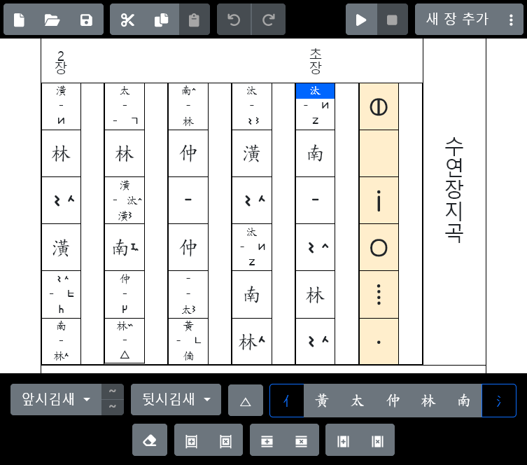

# 정간: 모바일 정간보 작·편곡기

언제 어디서나 정간보로 음악을 작성·편집·재생할 수 있는 (무료!) 프로그램입니다.

[https://tteoieonire.github.io/Jeonggan/](https://tteoieonire.github.io/Jeonggan/)에서 지금 바로 사용하실 수 있습니다.

## 기능

- 정간보 작성
  - [x] 장구 장단
  - [x] 니레, 니나 등 앞시김새 및 뒷시김새 기호
  - [ ] ~~숨표 (예정)~~
  - [ ] ~~악기별 주법 기호 (예정)~~
  - [ ] ~~농현, 농음 기호 (예정)~~
  - [ ] ~~덧길이·반길이, 늘임표 등 기타 기호 (예정)~~
- 정간보 편집
  - [x] 분박 구성 편집
  - [x] 실행 취소, 다시 실행
  - [x] 클릭 (터치) 후 드래그로 선택
  - [x] 잘라내기, 복사, 붙여넣기
  - [ ] ~~잘라내기, 복사 후 MS워드, 아래아한글 등에 붙여넣기 (예정)~~
- 정간보 재생
  - [x] 미디 (MIDI) 변환
  - [ ] ~~국악기 가상악기 재생 (예정)~~
  - [x] 앞시김새, 뒷시김새 재생
  - [x] 장구 재생
- 정간보 출력
  - [ ] ~~PDF 변환 지원 (예정)~~
  - [ ] ~~아래아한글 파일 (.hwpx) 변환 지원 (예정)~~

## 사용법

(작성 예정)

## 출처 및 사용 허가 조건

다음 내용은 이 프로그램을 수정하거나 재배포할 때 적용되는 내용으로, 사용자가 이 프로그램을 이용하여 만든 저작물(정간보 출력물, 미디 음원 등)에는 해당하지 않습니다.

### 장구 음원

다음 음원들은 [국립국악원 국악 디지털 음원](http://gugak.go.kr/digitaleum/front/phrase/list.do)에서 [공공누리 제1유형 (출처표시)](https://www.kogl.or.kr/info/license.do) 조건으로 개방한 음원을 가공한 것으로, 같은 조건으로 이용 가능합니다.

- 떵: [Janggu_1_1](./assets/Janggu_1_1.mp3)
- 쿵: [Janggu_3_2](./assets/Janggu_3_2.mp3)
- 덕: [Janggu_5_2](./assets/Janggu_5_2.mp3)
- 기덕: [Janggu_2_2](./assets/Janggu_2_2.mp3)
- 더러러러: [Janggu_4_2](./assets/Janggu_4_2.mp3)
- 더: [Janggu_6_2](./assets/Janggu_6_2.mp3)

### 떠이정간체 글꼴

떠이정간체([woff](./public/TteoiJeonggan.woff), [woff2](./public/TteoiJeonggan.woff2))는
다음 글꼴들을 바탕으로 제작한 2차 저작물이며, [SIL 오픈 폰트 라이센스 v1.1](https://scripts.sil.org/ofl)이 적용됩니다.

- [네이버 나눔스퀘어라운드 Bold](https://hangeul.naver.com/font/nanum) (SIL 오픈 폰트 라이센스 v1.1)
- [CNS11643 中文標準交換碼全字庫](https://data.gov.tw/en/datasets/5961) (SIL 오픈 폰트 라이센스 v1.1)

### 기타

상기 장구 음원과 떠이정간체 글꼴을 제외한 나머지 부분은 [GPL-3.0 라이센스](./LICENSE)에 따라
자유롭게 수정 및 재배포할 수 있습니다.
